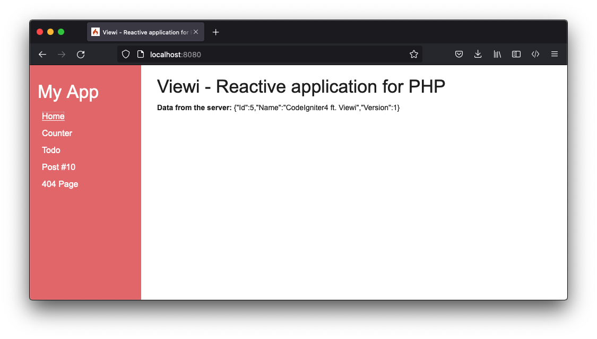
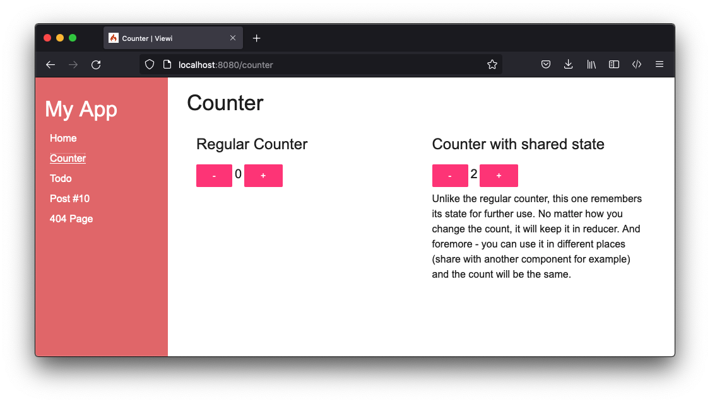
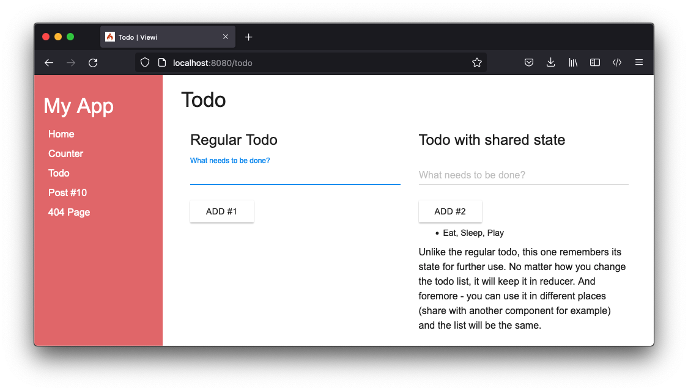
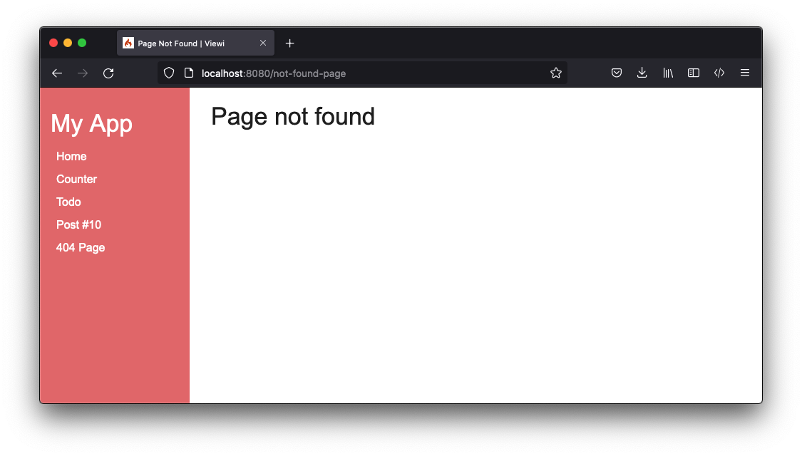

# CodeIgniter4 Viewi Demo

> Viewi allows you to create reactive web applications using your favorite PHP. It converts your code into native javascript code to run it in the browser. This way, you get a perfectly rendered HTML page on the first load, and at the same time, your page will remain reactive without requesting each next page on link clicks, etc.
https://viewi.net/






## How to Run

```console
$ git clone https://github.com/kenjis/ci4-viewi-demo.git
$ cd ci4-viewi-demo/
$ composer install
```

```console
$ php spark serve
```

Navigate to <http://localhost:8080/>.

## Folder Structure

```
.
├── app/
│   ├── Adapters/ ... Adapters for Viewi
│   └── ViewiApp/ ... Viewi App
│        ├── Components/
│        │   ├── Models/
│        │   ├── Services/
│        │   └── Views/
│        ├── build/     ... Do not touch
│        ├── config.php ... Viewi config file
│        └── routes.php ... Viewi routes file
├── public/
│   └── viewi-build/ ... Do not touch
```

## How to Code

`app/ViewiApp/Components/Views/Counter/Counter.php`:
```php
<?php

namespace Components\Views\Counter;

use Viewi\BaseComponent;

class Counter extends BaseComponent
{
    public int $count = 0;

    public function increment()
    {
        $this->count++;
    }

    public function decrement()
    {
        $this->count--;
    }
}
```

`app/ViewiApp/Components/Views/Counter/Counter.html`:
```html
<button (click)="decrement()" class="mui-btn mui-btn--accent">-</button>
<span class="mui--text-dark mui--text-title">$count</span>
<button (click)="increment()" class="mui-btn mui-btn--accent">+</button>
```

## How to Confirm Routes

```console
$ php spark routes

CodeIgniter v4.2.7 Command Line Tool - Server Time: 2022-10-20 20:04:40 UTC-05:00

+--------+--------------------+----------------------------------------+--------------------------------------+----------------+---------------+
| Method | Route              | Name                                   | Handler                              | Before Filters | After Filters |
+--------+--------------------+----------------------------------------+--------------------------------------+----------------+---------------+
| GET    | api/posts/([0-9]+) | »                                      | \App\Controllers\Api\Posts::index/$1 |                | toolbar       |
| GET    | /                  | Components\Views\Home\HomePage         | (Closure)                            |                | toolbar       |
| GET    | counter            | Components\Views\Pages\CounterPage     | (Closure)                            |                | toolbar       |
| GET    | todo               | Components\Views\Pages\TodoAppPage     | (Closure)                            |                | toolbar       |
| GET    | posts/([^/]+)      | Components\Views\Posts\PostsPage       | (Closure)                            |                | toolbar       |
| GET    | (.*)               | Components\Views\NotFound\NotFoundPage | (Closure)                            |                | toolbar       |
+--------+--------------------+----------------------------------------+--------------------------------------+----------------+---------------+

```

## References

- https://www.codeigniter.com/
- https://viewi.net/
- https://github.com/kenjis/ci4-viewi-tour-of-heroes
